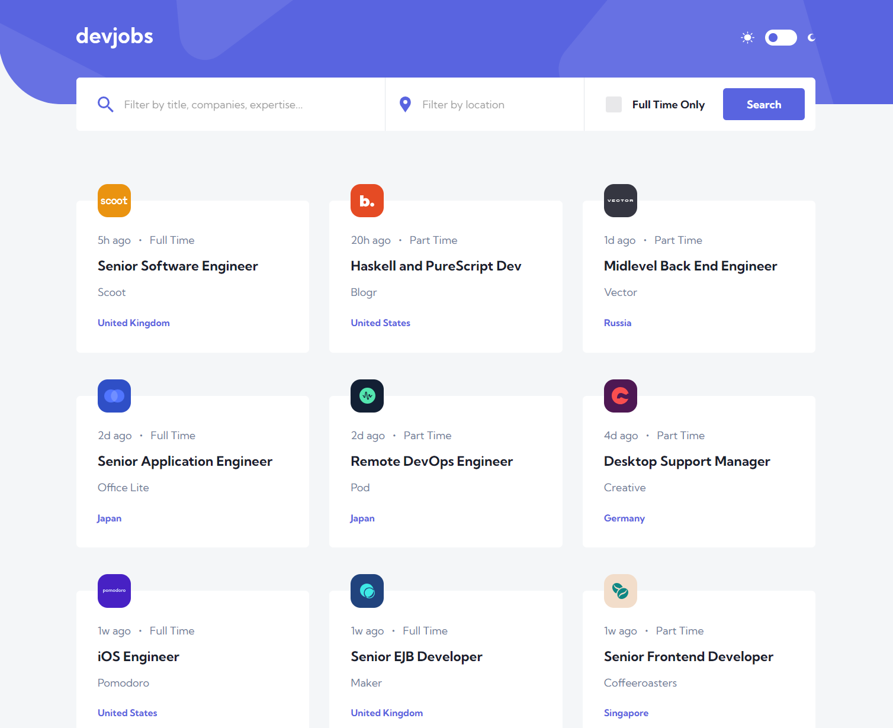
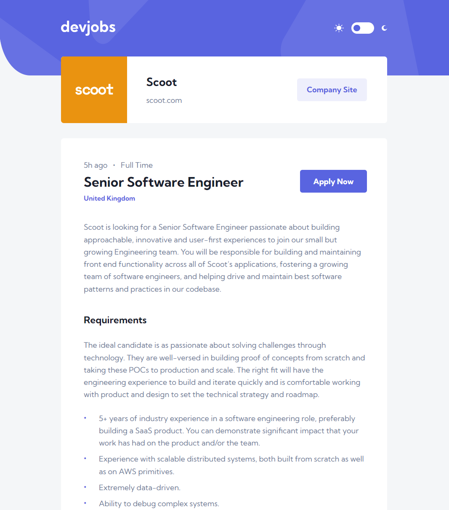
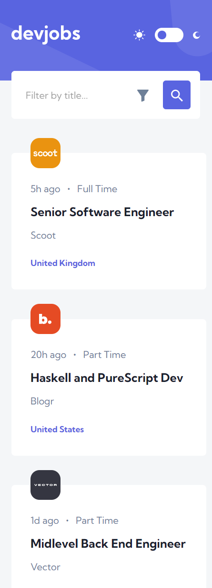

# Frontend Mentor - Devjobs web app solution

This is a solution to the [Devjobs web app challenge on Frontend Mentor](https://www.frontendmentor.io/challenges/devjobs-web-app-HuvC_LP4l). Frontend Mentor challenges help you improve your coding skills by building realistic projects.

### Links

- Solution URL: https://github.com/aaronrubinstein/devjobs-web-app
- Live Site URL:

### Screenshots

**Desktop**

**Inner Page**

**Mobile**

